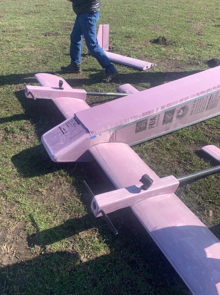

# Portfolio
## Projects
### L'SPACE NASA Proposal Writing and Evaluation Experience

Below is the quad chart for my idea that was selected by a NASA review board to move foward as a proposal. I will work as the Principal Investigator on a team of 12 student engineers over the next month to refine this idea and compete for chance to develop the technology with NASA.

### Freewing Experimental Aircraft Build

From January to May 2023, I was a member of the Hardware Integration Team for Husky Flying Club's Freewing Drone Build Project. The four-meter experimental drone has front wings that can freely rotate on their axis, giving the drone’s center of gravity mobility along its length. Designed for aerial agricultural fertilization, the drone won the $15,000 first prize in the 2023 Alaska Airlines Environmental Innovation Challenge. I developed proficiency in the following tools to machine and assemble its aluminum frame: vertical drill press, horizontal bandsaw, belt sander, and rivet gun. I also designed and built the foam nose cone using a hot wire bow cutter. 

[Article*](https://www.aa.washington.edu/news/article/2023-05-18/UW-startup-freyr-is-golden)

*I was part of the drone build team and not the business team that competed in the challenge.

 

<!-- This doesn't work: 

This works but the image dimensions do nothing: 

This works in the preview but won't show up on the site:   -->

## Skills
- Innovative team leadership demonstrated by expansion of technical clubs: i5 Space, Husky Flying Club
- Adept communication and organization demonstrated by company partnerships and event coordination
- Software/coding: Git, Linux, MATLAB (beginner), HTML, CSS
- Machining/building: vertical drill press, horizontal bandsaw, belt sander, rivet gun, hot wire bow cutter

## Education
**B.S., Aerospace Engineering | University of Washington, Seattle (_E.C.D. June 2026_)**
- GPA: 3.87
- Air Force ROTC HSSP Full Tuition Scholarship, MSgt James Healy Scholarship, College of Engineering Dean's List

**Study Abroad - Engineering Japan: Exploring in the Heart of High-Tech | Tohoku University in Sendai, Japan (_June 2023 – July 2023_)**
- Designed and tested multiple iterations of eight-inch unpowered model airplane to maximize flight time
- Explored innovative methods for stabilizing fuel cavitation in liquid rocket engines at High-Speed Flow Laboratory
- Studied aerodynamics and computer simulation aircraft design at Institute of Fluid Science

## Leadership
**Director of Engineering (_November 2023 – Present_)**

Husky Flying Club, University of Washington, Seattle, WA
- Initiated a space-focused branch of the engineering team by coordinating facility tours with Blue Origin and developing space-oriented engineering projects such as rocketry
- Collaborated with GEAR Up and Society of Women Engineers to provide engineering exposure to 40 low-income female high school students
- Organized safety meetings and recruiting events for 223 members
- Featured on UW News Page: The Daily as an example of early career leadership
  - [Article](https://www.dailyuw.com/arts_and_culture/community/giving-huskies-wings-revisiting-the-husky-flying-club/article_8c1359e4-e331-11ed-ab67-a304da6d2216.html#:~:text=The%20Husky%20Flying%20Club%20started,to%20%E2%80%9Cgive%20Huskies%20wings.%E2%80%9D)

**i5 Commander (_March 2023 – Present_)**

i5 Space, AFROTC Detachment 910, Seattle, WA
- Established the first chapter of i5 Space Club at the University of Washington
- Coordinated a series of informative meetings with Space Force professionals to equip a team of 11 cadets with comprehensive career insights

## Work Experience
**Website Developer (_August 2022 - Present_)** 

Academy of Lacey, Lacey, WA
- Provide reliable service in management of over 100 websites owned by Washington State government agencies
- Learn and utilize the Linux command line, Git, CSS, HTML, and JavaScript

## Extracurricular
**Alto Saxophonist (_August 2022 - Present_)**

Husky Marching Band, University of Washington, Seattle, WA
- Devote 8 to 15 hours weekly to rehearsal and performance of advanced music and drill sequences
- Cultivate skills of preparation and cooperation to effectively collaborate with an ensemble of 240 musicians

## Volunteering
**Soccer Coach (_February 2021 – May 2022_)**

Chinqually Booters Club, Lacey, WA
- Created learning models and designed practices to engage and challenge players of various skill levels, ages 9-11 years old
- Facilitated players’ development of leadership skills, work ethic, sportsmanship, and team camaraderie
